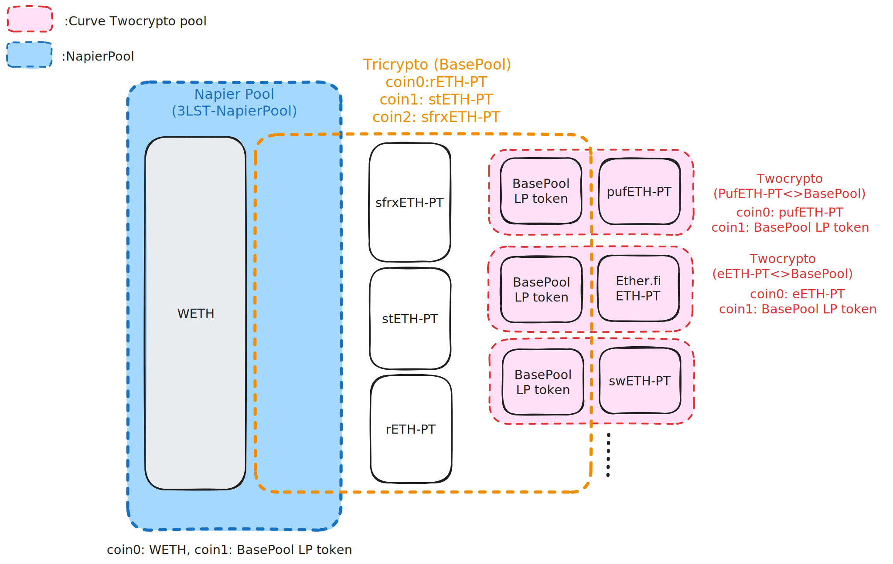

# Metapool Router

## Getting Started

### Requirements

The following will need to be installed. Please follow the links and instructions.

- [Foundry](https://github.com/foundry-rs/foundry)
- Python >= 3.10

### Quickstart

1. Install dependencies

Once you've cloned and entered into your repository, you need to install the necessary dependencies. In order to do so, simply run:

```shell
Python -m venv .venv
source .venv/bin/activate
pip install -r requirements.txt
forge install
```

2. Build

```bash
forge build
```

3. Test

```bash
forge test -vvv
```

For more information on how to use Foundry, check out the [Foundry Github Repository](https://github.com/foundry-rs/foundry/tree/master/forge).

### Development

- **Principal Token (PT)**: A token that represents the principal amount of a yield-bearing asset. It is a token that is pegged to the value of the underlying asset. For example, if the underlying asset is WETH and the yield-bearing asset is stETH, Napier will issue `stETH-PT (maturity-3 November 2024)`, which will be traded with discount against WETH and as the maturity date approaches, the discount will decrease and the price will converge to 1 WETH.
- **3LST-PT TriCrypto**: A Curve [TriCrypto-NG](https://docs.curve.fi/cryptoswap-exchange/tricrypto-ng/overview/) pool containing `stETH-PT`, `rETH-PT` and `sfrxETH-PT`, which is used as base pool for a Napier pool and TwoCrypto pools.
- **3LST NapierPool**: A Napier pool that contains `3LST-PT TriCrypto LP Token` and WETH. Technically, it's a lot like Pendle AMM, but it's more like a Metapool because it contains LP token as an asset.
- **Principal Token Metapool**: Curve TwoCrypto contract that allows users to deposit and withdraw principal tokens. Technically, it is a just a regular TwoCrypto but this pool assets are Napier Principal Token and TriCrypto LP Token.
- **Metapool Router**: The entry point for users. It is responsible for routing requests to the appropriate Metapool and zapping the assets into the Metapool. Those swaps are done through `3LST-PT TriCrypto`, `3LST NapierPool` and `Principal Token TwoCrypto`.
- **Metapool Factory**: A factory contract that allows `owner` to create new TwoCrypto contracts. It's just a wrapper around the permissionless `TwoCryptoFactory` contract but with some additional restrictions; assets must be Principal Token and TriCrypto LP Token, where these Underlying Tokens are WETH.



[Tech Spec](https://www.notion.so/napier-labs/Tech-spec-of-Curve-PT-Metapool-bc4820cefbf2409484f24953b6cd37dc?pvs=4)

### Deployment

WIP
